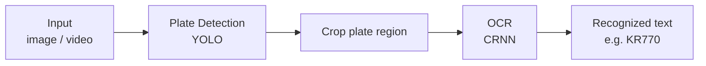
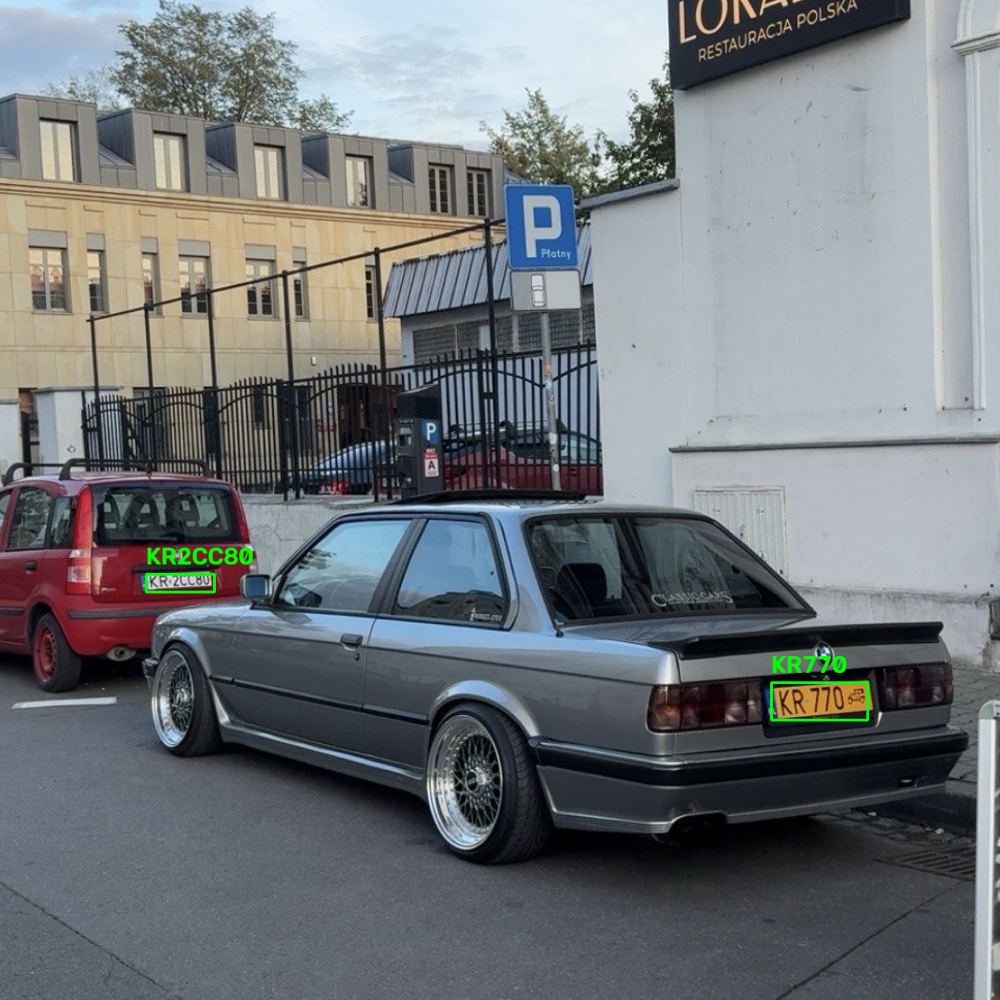
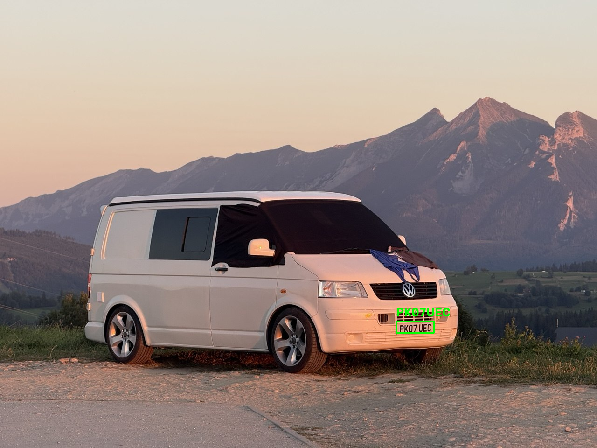

# ANPR — Automatic Number-Plate Recognition using PyTorch

**Detects license plate and recognizes text. Both YOLO(object-detection) and CRNN(OCR) are implemented and trained from scratch using PyTorch.**

## About

The goal of this project is to understand object detection, recognition models and pipelines by implementing
them end to end, rather than relying on existing frameworks. Every core component — the YOLOv1/YOLOv2 and CRNN
architectures, their loss functions, anchor generation, box decoding, the mAP evaluation, and CTC decoding — is 
written from scratch in PyTorch. I built each stage manually as a way to learn how these systems work internally. 
The fine-tuned YOLOv8n is included as a modern baseline to benchmark the hand-built detector against.

## Demo


## Features
 - **YOLOv2 built from scratch** - full model/train architecture, loss-function, **mAP** metrics for validation and testing implemented from original paper, then trained to detect license plates.
 - **YOLOv1 built from scratch** - full model/train architecture and loss-function implemented from original paper, then trained to detect license plates.
 - **CRNN OCR built from scratch** - **CNN** + **RNN** + **CTC** architecture implemented, then trained to recognize text.
 - **End-to-end inference** - full pipeline for processing images and videos.
 - **Three detection models** - a from-scratch YOLOv1, a from-scratch YOLOv2, and an optional fine-tuned YOLOv8n baseline for higher-precision detection.


## Architecture



### Components
 1. Object-detection
    - **YOLOv1 from scratch** - Trained, evaluated and tested on dataset.
    - **YOLOv2 from scratch** - Trained, evaluated and tested with mAP metrics on dataset.
    - **YOLOv8n fine-tuned** - pretrained on COCO dataset. Fine-tuned for plate-detection on the same dataset for more precise outcome.
 2. OCR
    - **CRNN** - CNN(feature extractor), RNN(sequence model), CTC(loss function). Implemented using PyTorch. Trained and tested to recognize text on cropped license plates. Data augmentation is used to improve training.

## Results

> Both detector and OCR were built and trained from scratch. The fine-tuned YOLO8n
> is included only as a reference baseline to benchmark the hand-built YOLOv2 against.

### OCR — CRNN (from scratch)
| Metric | Score |
|---|---|
| **Plate-level accuracy** (whole plate correct) | **97.5%** |
| **Character-level accuracy** | **99.5%** |

Trained with augmentation on the Nomeroff EU OCR dataset.


### Detection — YOLOv2 (from scratch)
| Model | mAP@0.5 | mAP@[.5:.95] |
|---|---|---|
| **YOLOv2 — from scratch** (test) | **96.2%** | 49.1% |
| YOLO8n — fine-tuned *(reference baseline)* | 96.2% | 87.5% |

The hand-built YOLOv2 localizes plates almost as reliably as the fine-tuned  
production model at the standard IoU 0.5 (94.5% vs 96.2%).  
The modern YOLOv8n architecture yields better results on the stricter IoU 0.5:0.95 metric.

### YOLOv2 — full breakdown
| Split | mAP@0.5 | mAP@0.75 | mAP@[.5:.95] |
|---|---|---|---|
| Validation | 91.7% | 72.8% | 61.8% |
| Test | 96.2% | 47.8% | 49.1% |

### Example outputs
<p align="center">
  
  
</p>

**Setup:** trained on GTX 1660. Anchors are computed using k-means. Augmentation is enabled for OCR and disabled for object-detection.

 **Datasets**:  
- YOLOv1, YOLOv2 training, YOLOv8n fine-tuning:  
  https://nomeroff.net.ua/datasets/autoriaNumberplateDataset-2026-06-04.zip
- CRNN training:  
  https://www.kaggle.com/datasets/abdelhamidzakaria/european-license-plates-dataset  
  https://nomeroff.net.ua/datasets/autoriaNumberplateOcrEu-2023-01-30.zip


## Limitations

- The detection head keeps YOLOv2's original 20-class output from the paper, but the model is trained on a single class (license plate), 
so most of that class capacity is unused.
- Inputs are resized to 416×416 without preserving aspect ratio, which can distort wide or tall images before detection.
- Test-set mAP stays high at IoU 0.5 but falls at stricter thresholds — localization is reliable, but box regression is less precise.
- Training data is European plates; performance on other regions is untested.
- Training and inference were tested on Linux and macOS. Behavior on Windows is unknown.


## Installation

**Hardware Requirements:**
To run this project efficiently, the following hardware is recommended:
* **CPU:** No specific requirements (any modern x86_64 or ARM processor).
* **CUDA (NVIDIA):** RTX 2060 or newer is recommended for Tensor Core support (autocast and scaler). 
Otherwise, disable mixed precision (autocast / GradScaler) in the training and evaluation loop 
* **MPS (Apple):** Apple Silicon (M1 chip or newer).

```bash
# 1. Clone the repo
git clone https://github.com/dmalynyak/ANPR-plate-recognition
cd ANPR-plate-recognition

# 2. Create a virtual environment
python3 -m venv .venv
source .venv/bin/activate # MacOS and Linux

# 3. Install dependencies
pip install -r requirements.txt
```

### Model weights
Three weights are included:  
 - **OCR:** weights/crnn.pt
 - **YOLOv2:** weights/yolov2.pt
 - **YOLOv8n fine-tuned:** weights/yolo8n_fine_tuned.pt

Due to file size limits, the trained weights(OCR and YOLOv2) are hosted in GitHub Releases. You need to download both files to run the project.

**Download via terminal:**
```bash
# Run from the project root to download models directly into the weights/ directory
wget https://github.com/dmalynyak/ANPR-plate-recognition/releases/download/weights/yolov2.pt -O weights/yolov2.pt                                    
wget https://github.com/dmalynyak/ANPR-plate-recognition/releases/download/weights/crnn.pt -O weights/crnn.pt
```
## Usage
1. **Training:**
```bash
  # CRNN training: saves weights in your_path/weights.pt
  python -m src.training.crnn_train --device your_device --save_path your_path
  
  # YOLOv2 training: loads model state(if you resume training, otherwise skip --resume argument)
  # saves weights in your_path/weights.pt
  python -m src.training.yolov2_train --device your_device --save_path your_path --resume your_weights_path
  
  # YOLOv1 training: saves weights in your_path/weights.pt
  python -m src.training.yolov1_train --device your_device --save_path your_path
```
2. **Inference:**  
Proceses an image or video. Gives final output as shown in demo.  
For detector argument you can choose either 'yolov2' - custom YOLOv2 model or 'yolov8n' - fine-tuned YOLOv8n model. 
The result is saved to path/file_out.ext.
```bash
    python pipeline.py --detector your_detector --device your_device --path file_path
```

## Project structure
```text

├── assets
├── .gitignore
├── pipeline.py  # pipeline which is called to inference input file.
├── README.md
├── requirements.txt
├── src
│   ├── parsing.py
│   ├── data_loaders
│   │   ├── crnn_dataload.py
│   │   ├── yolov1_dataload.py
│   │   └── yolov2_dataload.py
│   ├── eval
│   │   ├── yolov2_eval_architecture.py
│   │   └── yolov2_eval.py
│   ├── models
│   │   ├── crnn_model.py
│   │   ├── yolov1_model.py
│   │   └── yolov2_model.py
│   ├── train_architecture
│   │   ├── crnn_train_architecture.py
│   │   ├── yolov1_train_architecture.py
│   │   └── yolov2_train_architecture.py
│   └── training
│       ├── crnn_train.py
│       ├── yolo8n_fine_tune.py
│       ├── yolov1_test.py
│       ├── yolov1_train.py
│       └── yolov2_train.py
└── weights
    ├── crnn.pt # you should download it from GitHub Releases (see 'Model weights' section)
    ├── yolov2.pt # you should download it from GitHub Releases (see 'Model weights' section)
    ├── yolo8n_fine_tuned.pt
    └── results_info.txt  # results of mAP, recall, precision, accuracy of trained models
```