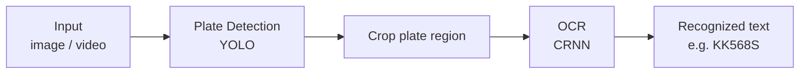

# ANPR — Automatic Number-Plate Recognition using PyTorch

**Detects licence plate and recognises text. Both YOLO(object-detection) and CRNN(OCR) are implemented and trained from scratch using PyTorch.**

## Demo


## Features
 - **YOLOv2 built from scratch** - full model/train architecture, loss-function, **mAP** metrics for validation and testing implemented from original paper, then trained to detect licence plates.
 - **YOLOv1 built from scratch** - full model/train architecture and loss-function implemented from original paper, then trained to detect licence plates.
 - **CRNN OCR built from scratch** - CNN + RNN + CTC architecture implemented, then traied to recognise text.
 - **End-to-end inference** - full pipeline for proccessing images and videos.
 - **Three detection models** - fine-tuned YOLO8n is available for more precise detections (can be used optionally) 

## Results

> Both detector and OCR were built and trained from scratch. The fine-tuned YOLO8n
> is included only as a reference baseline to benchmark the hand-built YOLOv2 against.

### OCR — CRNN (from scratch)
| Metric | Score |
|---|---|
| **Plate-level accuracy** (whole plate correct) | **97.5%** |
| **Character-level accuracy** | **99.5%** |

Trained with augmentation on the Nomeroff EU OCR dataset.


### Detection — headline comparison
| Model | mAP@0.5 | mAP@[.5:.95] |
|---|---|---|
| **YOLOv2 — from scratch** (test) | **94.5%** | 48.5% |
| YOLO8n — fine-tuned *(reference baseline)* | 96.2% | 87.5% |

The hand-built YOLOv2 localizes plates almost as reliably as the fine-tuned  
production model at the standard IoU 0.5 (94.5% vs 96.2%).  
Modern architecture YOLO8n shows better result in more strict IoU 0.5-0.95 test.

### YOLOv2 — full breakdown
| Split | mAP@0.5 | mAP@0.75 | mAP@[.5:.95] |
|---|---|---|---|
| Validation | 91.5% | 73.7% | 62.0% |
| Test | 94.5% | 39.3% | 48.5% |

### Example outputs


**Setup:** trained on RTX 1660, Nomeroff plate-detection dataset,   
anchors are computed using k-means, augmentation is off for OD, on for OCR.


## Architecture



### Components
 1. Object-detection
    - **YOLOv1 from scratch** - Trained, evaluated and tested on dataset.
    - **YOLO8n fine-tuned** - pretrained on COCO dataset. Fine-tuned for plate-detection for more precise outcome.
 2. OCR
    - **CRNN** - CNN(feature extractor), RNN(sequence model), CTC(loss function). Implemented using PyTorch. Trained and tested to recognise text on cropped licence plates.

 **Datasets**:  
- YOLOv1, YOLOv2 training, YOLO8n fine-tuning:  
  https://nomeroff.net.ua/datasets/autoriaNumberplateDataset-2026-06-04.zip
- CRNN training:  
  https://www.kaggle.com/datasets/abdelhamidzakaria/european-license-plates-dataset  
  https://nomeroff.net.ua/datasets/autoriaNumberplateOcrEu-2023-01-30.zip


## Installation
**Project uses MPS (Metal Performance Shaders) for Mac. If you use NVIDIA then change all 'device=mps' to 'device=cuda'**

```bash
# 1. Clone the repo
git clone https://github.com/dmalynyak/ANPR-plate-recognition
cd ANPR-plate-recognition

# 2. Create a virtual environment
python3 -m venv .venv
source .venv/bin/activate # MacOS and Linux

# 3. Install dependencies
pip install -r requirements.txt
```

### Model weights
Two weights are included:  
 - **OCR:** weights/ocr/crnn_best.pt
 - **YOLO8n fine-tuned:** weights/yolo/yolo8n_fine_tuned.pt


## Usage
1. **Training:**
```bash
  # CRNN training: saves weights in your_path/weights.pt
  python -m src.training.crnn_train --device your_device --save_path your_path
  
  # YOLOv2 training: loads model state(if you resume training, otherwise skip --resume argument)
  # saves weights in your_path/weights.pt
  python -m src.training.yolov2_train --device your_device --save_path your_path --resume your_weights_path
  
  # YOLOv1 training: saves weights in your_path/weights.pt
  python -m src.training.yolov1_train --device your_device --save_path your_path
```
2. **Inference:**  
Procceses image or video. Gives final output as shown in demo.  
Custom CRNN and fine-tuned YOLO8n models are available. YOLOv1 and YOLOv2 weights are too large to add to GitHub  
In order to use YOLOv1 and YOLOv2 models you need to train them.
```bash
    # for object-detection by default YOLO8n fine-tuned model is used
    # in order to change you need to change draw_img/video_8n to draw_img/video_v2
    # saves file into path/file_out.ext 
    python pipeline.py path/file.ext
```

