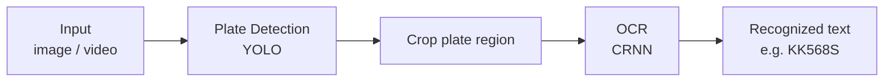

# ANPR — Automatic Number-Plate Recognition using PyTorch

**Detects licence plate and recognises text. Both YOLO(object-detection) and CRNN(OCR) are implemented and trained from scratch using PyTorch.**

## Demo


## Features
 - **YOLOv1 built from scratch** - full model/train architecture and loss-function implemented from original paper, then traied to detect licence plates .
 - **CRNN OCR built from scratch** - CNN + RNN + CTC architecture implemented, then traied to recognise text.
 - **End-to-end inference** - full pipeline for images and video, !!!
 - **Two detection models** - fine-tuned YOLO8n for more precise detections (can be used optionally) 

## Architecture



### Components
 1. Object-detection
    - **YOLOv1 from scratch** - Trained, evaluated and tested on dataset.
    - **YOLO8n fine-tuned** - pretrained on COCO dataset. Fine-tuned for plate-detection for more precise outcome.
 2. OCR
    - **CRNN** - CNN(feature extractor), RNN(sequence model), CTC(loss function). Implemented using PyTorch. Trained and tested to recognise text on cropped licence plates.

 **Datasets**:  
- YOLOv1 training, YOLO8n fine-tuning: https://nomeroff.net.ua/datasets/
- CRNN training: https://www.kaggle.com/datasets/abdelhamidzakaria/european-license-plates-dataset

## Results

## Installation

## Usage
1. Training:
 ```bash
  python crnn_train.py save_path    # OCR training
  python yolov1_train.py save_path  # YOLOv1 training
  ```
2. Inference:  
Procceses image or video. Gives final output as shown in demo. 
 ```bash
    python pipeline.py path/file.ext #saves file path/file_out.ext 
```

